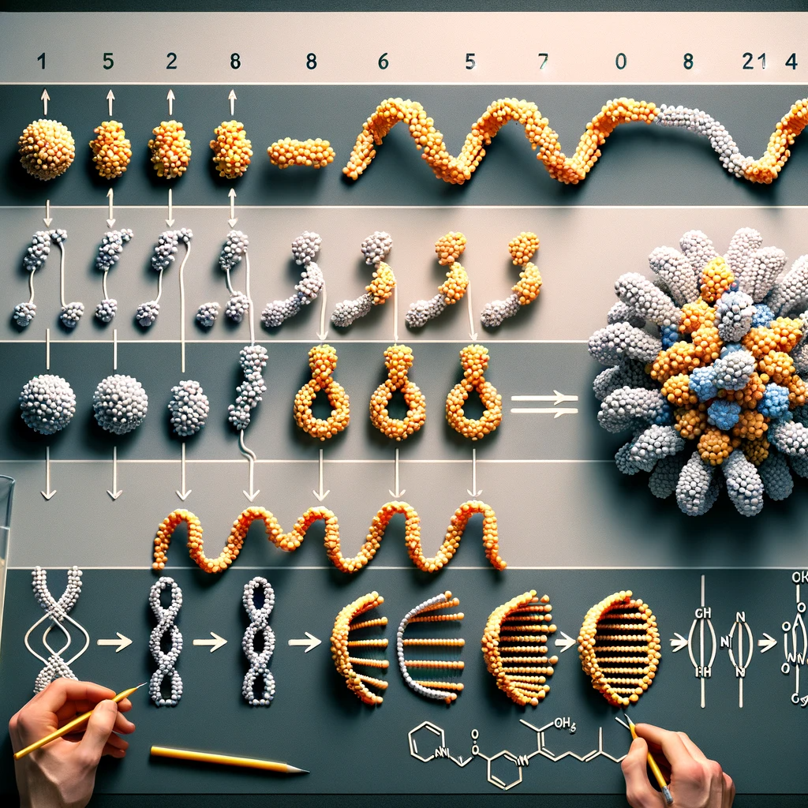

# Predicting Protein Tertiary Structure from Sequences Using Deep Learning

Protein structure prediction represented a longstanding challenge in computational biology, bearing substantial implications for comprehending protein functionalities and interactions. In this white paper, we presented an integrated approach to predict protein tertiary structures by amalgamating techniques from two seminal papers: "Deep Supervised and Convolutional Generative Stochastic Network for Protein Secondary Structure Prediction" authored by Jian Zhou and Olga G. Troyanskaya (2014) and "Protein Secondary Structure Prediction Using Deep Convolutional Neural Fields" by Sheng Wang et al. (2016). The objective was to guide researchers and practitioners in the field of structural biology through the process of predicting whole protein structures from amino acid sequences, harnessing deep learning methodologies.

## Introduction

Predicting protein tertiary structures has long been a pivotal facet of comprehending cellular functions, expediting drug discovery, and unraveling disease mechanisms. The endeavor to accurately forecast protein tertiary structures from primary sequences has remained an intricate undertaking. This white paper delineates a comprehensive approach that amalgamates secondary structure prediction with tertiary structure modeling, leveraging deep learning methodologies.

## Data Preparation

Data Collection -  The initial step encompassed the assembly of a dataset comprising protein sequences earmarked for tertiary structure prediction. Rigorous dataset labeling was executed with secondary structure information.
Data Preprocessing - Stringent data cleaning and preprocessing measures were enacted, in adherence to prerequisites stipulated by the chosen deep learning models. 

> CullPDB53 Dataset (6125 proteins):The CullPDB53 dataset is a non-redundant set of protein structures from the Protein Data Bank (PDB). https://www.rcsb.org/.

> The CB513 dataset is often used for protein secondary structure prediction. https://www.princeton.edu/~jzthree/datasets/ICML2014/.

> The Critical Assessment of Structure Prediction (CASP) datasets are used for protein structure prediction and related tasks.  http://predictioncenter.org/.

> CAMEO Test Proteins (6 months): The CAMEO (Continuous Automated Model EvaluatiOn) test proteins are used for protein structure prediction evaluation. http://www.cameo3d.org/sp/6-months/.

> JPRED Training and Test Data (1338 training and 149 test proteins): The JPRED dataset provides training and test data for protein secondary structure prediction. http://www.compbio.dundee.ac.uk/jpred4/about.shtml.

## Feature Extraction

The feature extraction protocols, as delineated in the selected papers, were methodically implemented.
Convolutional neural networks (CNNs) were assimilated into the framework to systematically extract informative features from protein sequences.

## Secondary Structure Prediction

The DCGSN model (Zhou and Troyanskaya, 2014) was operationalized to prognosticate secondary structures (helix, strand, coil) predicated on the features extracted.
A sequence of secondary structure elements was derived for each protein entry in the dataset.

## Tertiary Structure Prediction

To extrapolate whole tertiary structures, an expansion beyond secondary structure prediction was deemed imperative.
The projected secondary structure information was judiciously leveraged to delineate the tertiary structure prediction paradigm. This encompassed methodologies spanning homology modeling, ab initio modeling, and molecular dynamics simulations.
Due consideration was accorded to the integration of avant-garde methodologies, exemplified by AlphaFold, with the intent of enhancing tertiary structure predictions.

## Model Integration

A confluence of the secondary structure predictions from DCGSN and the tertiary structure projections, as generated in step 5, was systematically orchestrated.
The secondary structure details were strategically employed to govern the placement and alignment of secondary structure components within the anticipated tertiary structures.

## Evaluation and Refinement

A comprehensive assessment was undertaken to gauge the precision of the amalgamated predictions, relative to benchmark datasets and empirical data.
The integrated model and prediction methodologies underwent meticulous refinement, informed by the evaluation outcomes and insights gleaned from empirical validation.

## Visualization and Analysis

The anticipated protein structures, encompassing both secondary and tertiary structures, were subject to systematic visualization.
The structural analysis was meticulously executed, with comparative studies vis-à-vis established protein structures, facilitating inferences pertaining to protein functionalities and interactions.

## Conclusion

In this white paper, we have expounded an approach for predicting protein tertiary structures, which synthesizes deep learning techniques for secondary structure prediction with methodologies for tertiary structure modeling. While the precision of predictions might exhibit variations contingent on data quality and protein intricacy, this amalgamated approach holds the potential to propel our comprehension of protein functionalities and interactions to new heights.

## Acknowledgments

Recognition is duly accorded to the original authors of the referenced papers within this white paper: Jian Zhou, Olga G. Troyanskaya, Sheng Wang, et al.